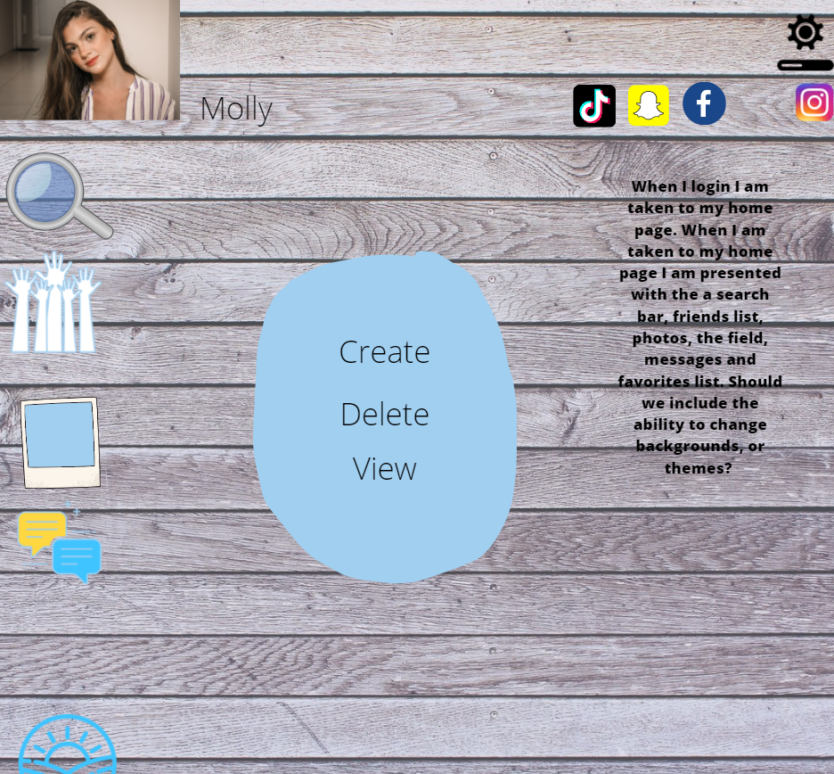

# **Forum Finder**

  **Live Deployment Link:** https://mighty-citadel-48600.herokuapp.com
  
# **Mock-Up of Front-End:**

  # Table of Contents 
  - [Description](#description)
  - [Project-Standards](#project-standards)
  - [Technologies Used](#technologies-used)
  - [Successes](#successes)
  - [Challenges](#challenges)
  - [Installation and Usage](#installation)
  - [Usage](#usage)
  - [Contributors](#contributors)

## **GIVEN a note-taking application**
 - **AS A USER** with a question, thought, or comment
   - **I WANT** a platform to share ideas
   - **SO THAT** other people can interact with them.

# **Description:**

Forum Finder is a social networking website designed to connect it's users through user-generated forums. Within these forums, other users can post their thoughts, and upvote or downvote other user's posts. Users may also favorite a forum, and view their favorites separately forum the global forum stream.

Forum Finder was designed for anyone on the internet with a thought to share or a question to ask. Users of Reddit, Quora, or any other forum-based website may find use from Forum Finder

In making Forum Finder, we hope to create a platform where people of all backgrounds and professions can ask questions, share stories, make friends, and connect with one another.
    
## **Project Standards**
### Secure
- Bcrypt password hashing and env files used to avoid publishing sensitive info
### Maintainable
- Clean, efficiently utilized database with Sequelize and Express.js. Logical back-end flow for greater performance
### User-Friendly
- Impact user interaction. We want a stylish and easy to use UI generated with Hanlebars.js and using Bulma for styling and responsiveness for mobile devices.

## **Technologies Used:**
### Model:
    - MySQL
    - Sequelize
    - Heroku
    - JavaScript
    - Dotenv
    - Bcrypt
### View:
    - Handlebars.js
    - CSS
### Controller:
    - Node.js
    - Express.js
    - Insomnia
    - Express-Session
    - JAWSDB

## **Successes:**
### Organization
- By utilizing agile-development concepts, we were able to establish a clear timeline and set of responsibilities, which could have greatly increased our productivity
### Collaboration
- Efficient task delegation and consistent communication between group members allowed for some asynchronous progress while also clearly documenting our work
### Education
- We were able to greatly expand our skills as developers. This extended, not only to our coding ability, but also to the interpersonal skills that make group-work productive

## **Challenges:**
### Balance
- Like any other team, we came across some coding challenges. Having varying degrees of abilities in certain aspects. Handlebars was our most difficult area to get established, which really constrained our front-end development.
### Ideas/Visions
- Working together, was not so much a challenge. We all believe that this was a great group, with great attitudes. The biggest challenge in collaborating, was getting our visions across and understood throughout the teammates.
### Scheduling
- A daily planner was instilled early on in the project. With date and coding goals.  That being said, this plan, allowed cushion for making the best of any scenario, and sticking to it.  

## **Installation:**
Install straight from Github onto a local directory!

  ## **Usage:**
  Use this link on Insomnia or Postman: https://mighty-citadel-48600.herokuapp.com
  - This connects and tests on Forum-Finder's server on Heroku
  - From there you can create a new forum, create a new post, create a new user, log in and generate session cookies

 **OR**

 To run it on the back-end type 'node server'
  - 'node server' activates this on local port 3001
  - Navigate to "http://localhost:3001/api/(route-name)" to test it out there.
  
  ## **Contributors:**

- ### [AidanGuarniere](https://github.com/AidanGuarniere)

- ### [jwilferd10](https://github.com/jwilferd10)

- ### [khuggins1](https://github.com/khuggins1)

- ### [VSLG2020](https://github.com/VSLG2020)

  

  
